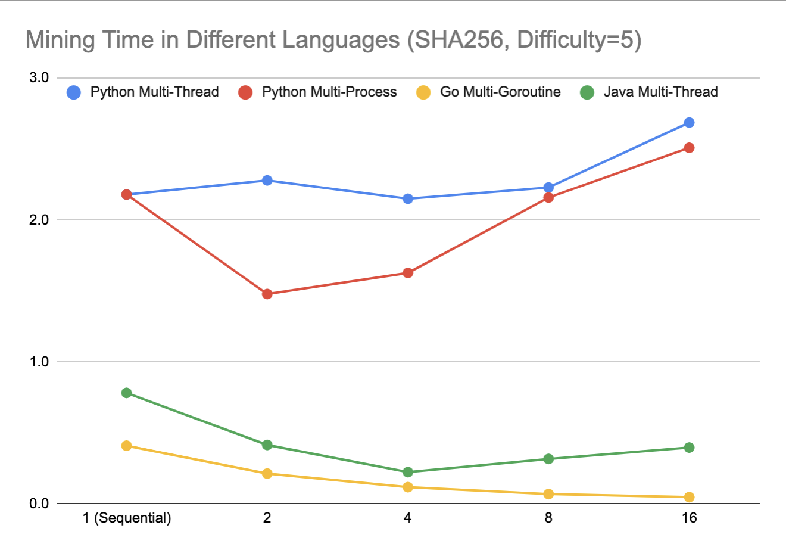
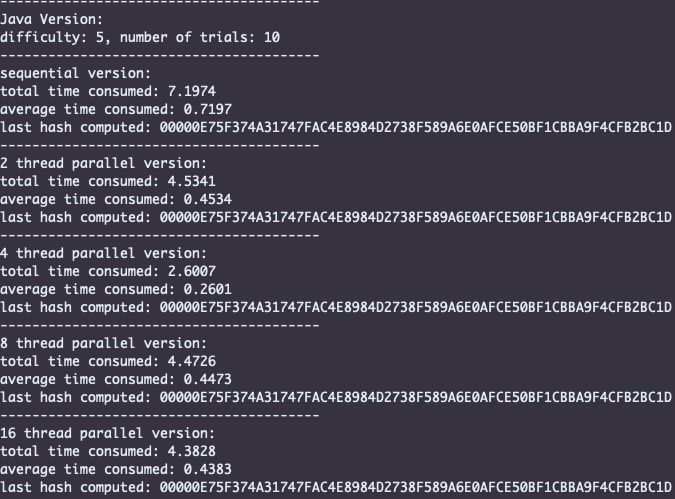
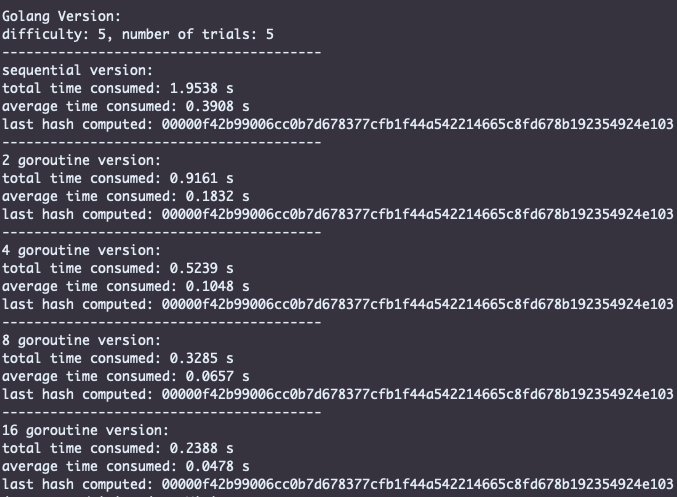
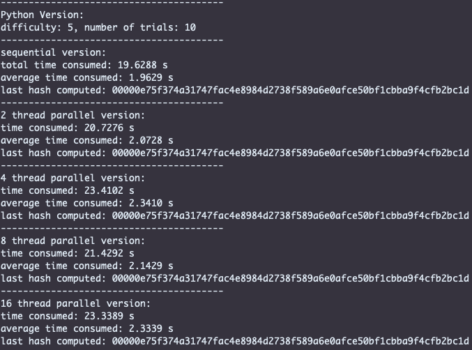
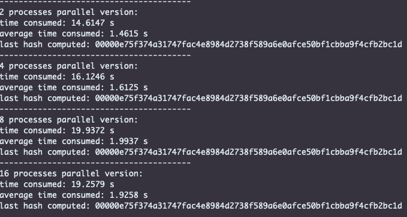

## Performance Comparison of Different Languages Doing Mining

Just for fun, I did some benchmarking on the performance of different programming languages doing mining.

I compared the performance of Java, Go and Python, running in both sequential and parallel versions. The benchmarking uses SHA256 with a difficulty of 5 (5 prefix "0"s) and runs 10 iterations, using randomized strings as input at each iteration. The benchmarking is performed on Andrew Linux machines.

The way to parallelize the computation is to spawn a few threads, and each one of them gets a separate search space. Whoever find the answer first will return the hash and terminate the other threads. Since this is an intented 'race', synchronization is very simple and the overhead incurred is minimal.

Here is a summary of the results:  
The vertical axis is the time needed to mine a hash. The horizontal axis is the number of threads or processes.

Python is indeed slow!!

Notice that Python's multi-threaded version is even slower than its sequential version because of the GIL. Python multi-processing can improve performance because each process get its own interpreter, but the speedup gained is very limited.

Go is particularly performant when scaling up the number of goroutines (a light-weight thread of execution), but 16-goroutine is probably as far as it can go - when I scale it to 32 goroutines, the performance worsens.

Here are the numeric results if you are interested:

